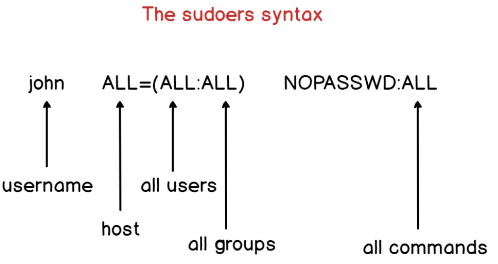

บทความนี้ จะอธิบายวิธีการติดตั้งและ การใช้งานคำสั่ง sudo บน Debian

## ขั้นตอนการติดตั้ง sudo บน Debian Linux

1. Gain สิทธิ์ root โดยใช้คำสั่ง `su -`
2. อัปเดตแพ็คเกจให้เป็นเวอร์ชั่นล่าสุด

```shell 
apt update && apt upgrade 
```
3. ติดตั้ง sudo โดยใช้คำสั่ง `apt`  หรือ `apt-get`

```shell
apt install sudo
```

## การแก้ไขไฟล์ /etc/sudoers

การแก้ไขสิทธิ์การใช้งาน sudo เราจะแก้ไขที่ไฟล์ `/etc/sudoers` และระบบจะตรวจสอบว่าผู้ใช้งานมีสิทธิใช้คำสั่ง sudo หรือไม่ในไดเร็กทอรี `/etc/sudoers.d/`

> /etc/sudoers


วิธีที่ดีที่สุดและปลอดภัยในการแก้ไขไฟล์ `/etc/sudoers` คือการใช้คำสั่ง `visudo`

```shell
visudo -f /etc/sudoers
```

จากนั้น เพิ่มผู้ใช้งานที่ต้องการให้สามารถใช้คำสั่ง sudo ได้ลงในไฟล์ที่สร้าง ด้วยคำสั่งนี้:

```shell
newuser ALL=(ALL) ALL
```

แล้วบันทึกและออกจากโปรแกรมแก้ไข คำสั่งข้างบน จะให้ newuser สามารถเรียกใช้คำสั่งใดๆ (ALL) ในฐานะผู้ใช้ใดๆ (ALL) บนโฮสต์ใดๆ (ALL) พร้อมสิทธิ์การดูแลระบบเต็มรูปแบบโดยใช้ `sudo`



## การทดสอบ

หากต้องการทดสอบ ให้เข้าสู่ระบบและพิมพ์คำสั่งที่ต้องมีสิทธิ์ระดับรูทโดยใช้ `sudo` ตัวอย่างเช่น:

```shell
sudo ls /root
```

หากการกำหนดค่าถูกต้อง newuser จะสามารถใช้งาน sudo ได้ และ execute โดยไม่มี Error 

## บทสรุป

ในบทความนี้ จะได้ความเข้าใจพื้นฐานเกี่ยวกับวิธีการอ่านและแก้ไขไฟล์ sudoers และเข้าใจถึงขั้นตอนและวิธีการต่างๆ ในการเพิ่ม user เพื่อให้สิทธิ์ root ได้แล้ว