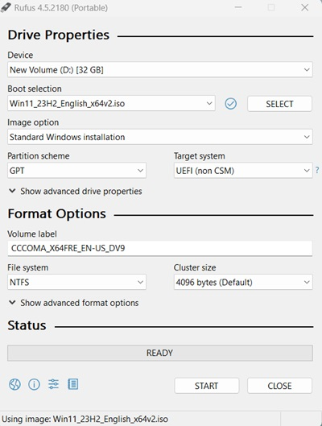
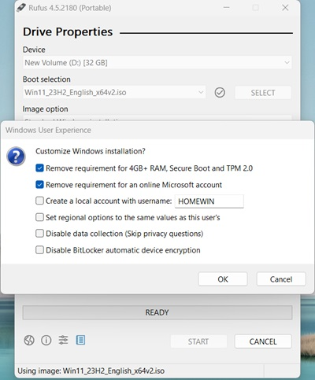
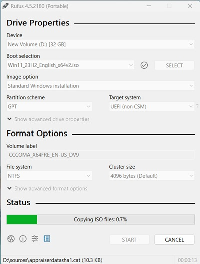

Rufus คือโปรแกรมที่ช่วยฟอร์แมทและสร้าง USB แฟลชไดรฟ์ที่สามารถบูทได้ เช่นคีย์ USB / pendrives, Memory Sticks, ฯลฯ

## ขั้นตอนการสร้าง Windows 11 bootable USB โดยใช้ไฟล์ ISO

1. รันโปรแกรม Rufus ขึ้นมา หรือถ้ายังไม่มี สามารถดาวน์โหลดได้ [ที่นี่](https://rufus.ie/)
2. ในส่วน `Device` ให้เลือกแฟลชไดรฟ์ USB ที่จะใช้สร้างสื่อสำหรับบูต Windows 11
3. ในส่วน `Boot selection` เลือก select `Disk or ISO image` ที่จะทำการสร้าง bootable USB
4. ในส่วน `Image option` เลือก `Standard Windows 11 Installation`
5. ในส่วน `Partition scheme` เลือก `GPT`
6. ในส่วน `Target system` เลือก `UEFI (non-CSM)`
7. กดปุ่ม `Start`
8. ทำการ check รายละเอียดในหน้า windows user experience

`"Remove requirement for 4GB+ RAM, Secure Boot and TPM 2.0"` คือการข้ามข้อกำหนดด้านฮาร์ดแวร์ของ Windows 11

`"Remove requirement for an online Microsoft account"` ตัวเลือกเพื่อให้สามารถสร้าง local account ได้

`"Create a local account with username"` ระบุชื่อบัญชีหากคุณต้องการติดตั้งด้วยบัญชี local account

`"Set regional options to the same values as this user's"` หมายถึงการตั้งค่าตัวเลือกทางภูมิศาสตร์ให้มีค่าเหมือนกับผู้ใช้ของเครื่องนี้

`"Disable data collection (Skip privacy questions)"` ข้ามการตอบคำถามความเป็นส่วนตัว

`"Disable BitLocker automatic device encryption"` ปิดการเข้ารหัสอุปกรณ์อัตโนมัติโดยใช้ BitLocker

9. เมื่อทำการ check เรียบร้อยแล้วใหเ้กดปุ่ม `OK`

10. รอจนเสร็จแล้วจะขึ้น READY สามารถปิดโปรแกรมแล้วนำ USB ไป boot ได้เลย

## บทสรุป

ในบทความนี้ เราได้เรียนรู้วิธีสร้าง Bootable USB จากไฟล์ ISO โดยใช้เครื่องมือ Rufus